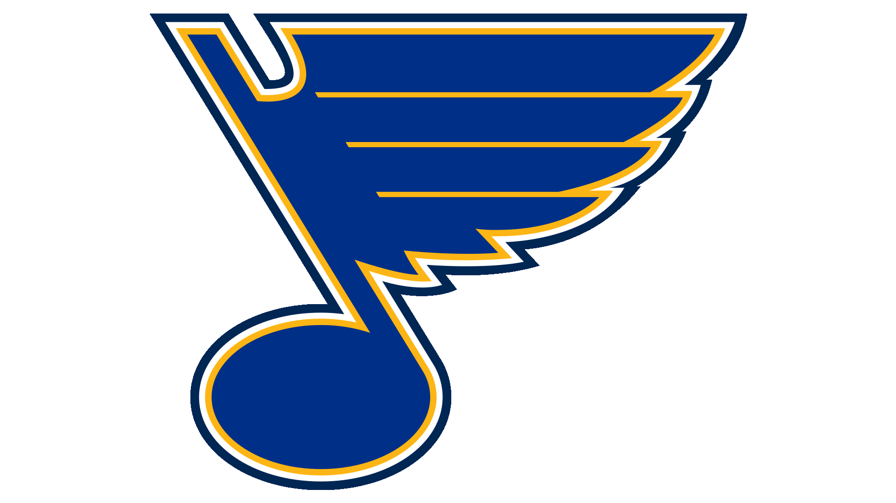

# The St. Louis Blues
## St. Louis' Hockey Team
The _St. Louis Blues_ are an NHL (National Hockey League) team that represnts the city of **St. Louis, Missouri**. They play their games at the **Enterprise Center**, located at _1401 Clark Ave_ downtown. Here is some information about the Blues as of 2022:
+ Their head coach is Craig Berube
+ Their General Manager is Doug Armstrong
+ Their owner is Tom Stillman
+ They have won only 1 Stanley Cup championship, beating the Boston Bruins in 2019
+ Their name comes from the history of Blues music in St. Louis
### Who Plays for the Blues?
#### Some players that currently play for the Blues include:
1. Vladimir Tarasenko
2. Brayden Schenn
3. Justin Faulk
4. Tory Krug
5. Colton Parayko
6. Pavel Buchnevich
7. Ryan O'Reilly
8. Jordan Kyrou
9. Robert Thomas
#### Goalies
+ Jordan Binnington
+ Thomas Griess

For the full roster, [click here](https://www.nhl.com/blues/roster)

[Check out St. Louis' MLB Team]
[Home Page]
