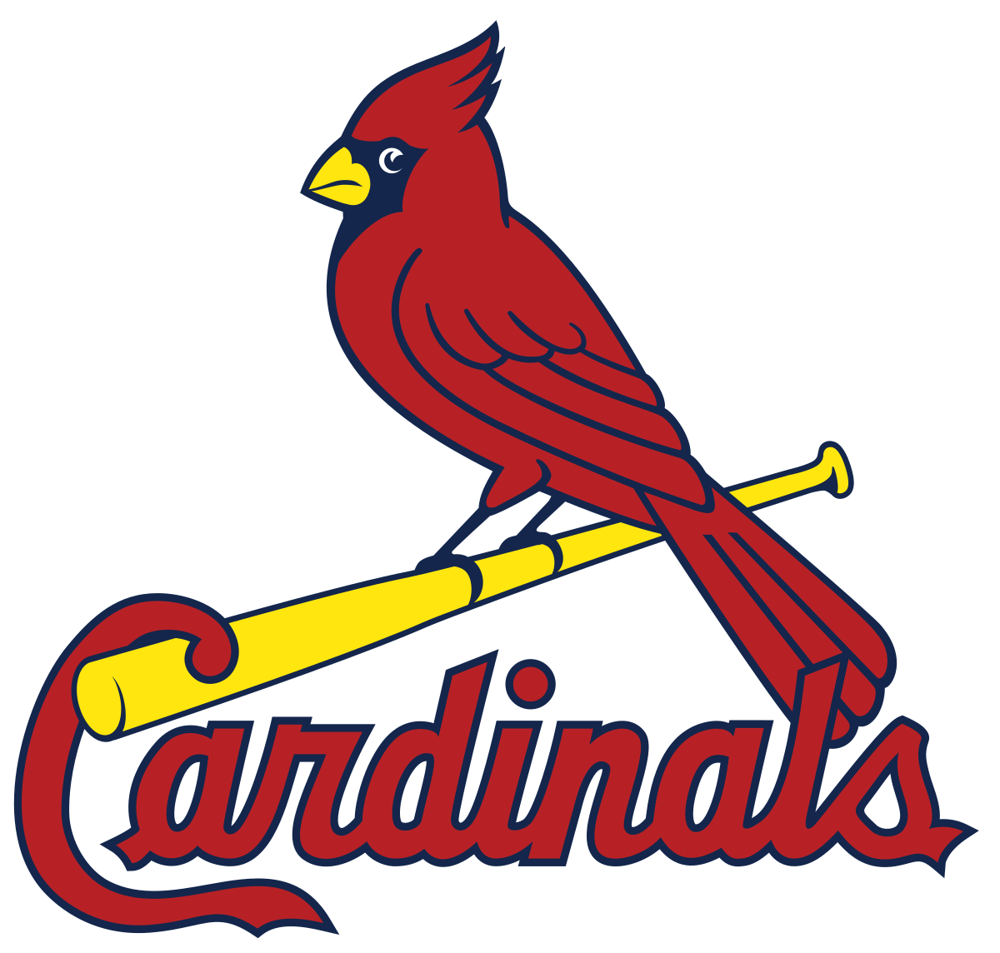

# The St. Louis Cardinals
## St. Louis' MLB Team
The _St. Louis Cardinals_ is the MLB (Major League Baseball Team) that represents the city of **St. Louis, Missouri**. They play their games at **Busch Stadium**, located at _700 Clark Ave_ downtown.
Here is some information about the Cardinals as of 2022:
+ Their current manager is Oli Marmol
+ Their current General Manager is John Mozeliak
+ Their current owner is Bill DeWitt
+ They have won 11 World Series
  - Their most recent title was in 2011 against the Texas Rangers
  - They are in 2nd place for most World Series wins, behind The New York Yankees who have 27
+ They are known for having a loyal fanbase, earning the 2nd highest attendence in the 2022 season behind the Los Angeles Dodgers
### Who Plays for the Cardinals?
#### Some of the current roster composes of:
1. Paul GoldSchmidt (1st Base)
2. Tommy Edman (2nd Base)
3. Brendan Donovan (Shortstop)
4. Nolan Arenado (3rd Base)
5. Andrew Knizner (Catcher)
6. Tyler O'Neill (Left Field)
7. Dylan Carlson (Center Field)
8. Lars Nootbaar (Right Field)
#### Pitchers:
+ Adam Wainwright
+ Jack Flaherty
+ Miles Mikolas
+ Jordan Montgomery
+ Jose Quintana
+ Ryan Helsley

For the full 40 Man Roster, [click here.](https://www.mlb.com/cardinals/roster/40-man)

+ [Check out St. Louis' NHL Team](StLouisBlues.md)
+ [Home Page](README.md)
